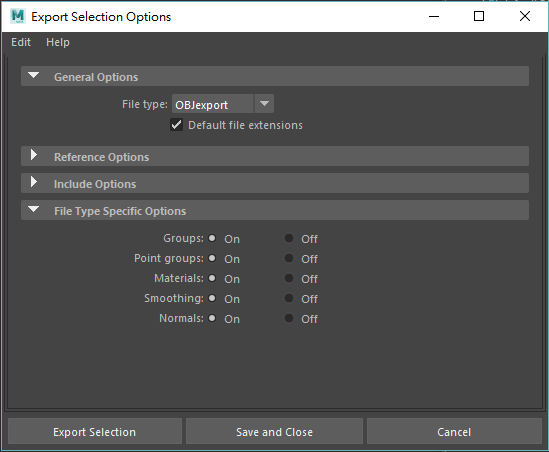

# Maya API cpp File Translator

## Derive from MPxFileTranslator

```cpp
#include <maya/MPxFileTranslator.h>

class CustomTranslator : public MPxFileTranslator
{
    // Declarations...
};
```

## The MPxFileTranslator methods could be extend requirements

+ bool haveNamespaceSupport() const;
+ bool haveReferenceMethod() const;
+ bool canBeOpened() const;
+ MString filter() const;
+ MString defaultExtension() const;
+ bool haveReadMethod() const;
+ bool haveWriteMethod() const;

## Importer

You need to implement `haveReadMethod` and `reader` methods.

```cpp
bool CustomFileTranslator::haveReadMethod() const
{
    return true;
}

MStatus CustomFileTranslator::reader(
    const MFileObject & fileObject,
    const MString & options,
    FileAccessMode mode)
{
    // Reader implement...
}
```

## Exporter

You need to implement `haveWriteMethod` and `writer` methods.</br>

```cpp
bool CustomFileTranslator::haveWriteMethod() const
{
    return true;
}

MStatus CustomFileTranslator::writer(
    const MFileObject & fileObject,
    const MString & options,
    FileAccessMode mode)
{
    // Writer implement...
}
```

## Writer & Reader method arguments

There have three arguments in `writer` and `reader` methods.</br>

+ `const MFileObject & fileObject` -> the name of the file to write / read</br>

```cpp
const MString fileName = fileObject.fullName();
// Use std::ofstream in <fstream>
// In writer use std::ios::out flag.
// In reader use std::ios::in flag.
std::ofstream newFile(fileName.asChar(), std::ios::out);
// Check file is opened correctly.
if (!newFile)
{
    MGlobal::displayError(filename + " could not be open.");
    return MS::kFailure;
}
stat = newFile.setf(std::ios::unitbuf);

//... Implements

newFile.flush();
newFile.close();
```

+ `const MString & options` -> a string representation of any file options.</br>

> The options is a string, for example `"optionA=valueA;optionB=valueB;optionC=valueC"`.</br>
> All options separated by `";"`, you have to split it by yourself.

```cpp
struct TranslatorOptions
{
    MString optionA;
    MString optionB;
    MString optionC;
};

void parseOptions(const MString options, TranslatorOptions & to)
{
    MStringArray temp_option;
    MStringArray option_list;
    options.split(';', option_list);
    for (int i = 0 ; i < option_list.length(); i++)
    {
        temp_option.clear();
        option_list[i].split('=', temp_option);
        if (temp_option.length() < 2)
        {
            continue;
        }
        switch(temp_option[0])
        {
        case "optionA":
            to.optionA = temp_option[1];
            break;
        case "optionB":
            to.optionB = temp_option[1];
            break;
        case "optionC":
            to.optionC = temp_option[1];
            break;
        }
    }
}
```

+ `FileAccessMode mode` -> the method used to write the file - save, export, or export active.

| Enum                      | Description                                                      |
| ------------------------- | -----------------------------------------------------------------|
| kUnknownAccessMode        | This mode is set when no file operation is currently in progress.|
| kOpenAccessMode           | This mode is set when data is begin read into a new scene.       |
| kReferenceAccessMode      | This mode is set when a referenced file is begin read.           |
| kImportAccessMode         | This mode is set when data is begin read into the current scene. |
| kSaveAccessMode           | This mode is set when the user saves the file.                   |
| kExportAccessMode         | ...export all or a referenced file is being out.                 |
| kExportActiveAccessMode   | ...selected items are to be exported.                            |

## Extension

Implement `MPxTranslator::defaultExtension`</br>
For example, If you want the translator file's extension is `*.raw`.</br>

```cpp
MString CustomFileTranslator::defaultExtension() const
{
    return "raw";
}
```

## Check the incoming file is valid

Implement `MPxFileTranslator::identifyFile`</br>
It have to return a enumerate - MPxFileTranslator::MFileKind</br>

+ `kIsMyFileType` - Translator understands how to read / write this file.
+ `kCouldBeMyFileType` - Translator is not best available to read / write this file.
+ `kNotMyFileType` - Translator does not understand how to read / write this file.

```cpp
MPxFileTranslator::MFileKind CustomTranslator::identifyFile(
    const MFileObject & fileName,
    const char * buffer,
    short size) const
{
    const MString kMagic("MAGIC");
    MFileKind kind = kNotMyFileType;
    // Use strncmp to compare magic and file buffer
    int compare_result = strncmp(buffer, kMagic.asChar(), kMagic.length());
    if(size >= (short)magic.length() && (0 == compare_result))
    {
        kind = kIsMyFileType;
    }
    return kind;
}
```

## Register Options MEL

You can register a MEL procedure with a specific proc name.

For example :</br>
Create a mel file called `"customTranslatorOpts.mel"`</br>
In this mel file, we have a proc :

```mel
global proc int customTranslatorOpts(
    string $parent,
    string $action,
    string $initialSettings,
    string $resultCallback
)
{
    // Description
    // Parameters :
    //      $parent : The elf parent layout for this options layout, It is always a scrollLayout.
    //      $action : The action that is to be performed with this situation of this proc.
    //          "query" - construct the options.
    //          "post"  - post all the elf controls.
    //      $initialSettings : The current options string.
    //      $resultCallback : This is the proc to be called with the result string.
    // Return :
    //      1 if successful.
    //      0 otherwise.
    int $result;
    int $index;
    string $currentOptions;
    string $optionList[];
    string optionSplitTemp[];
    if ($action == "post")
    {
        // Set options layout here.
        $result = 1;
    }
    else if ($action == "query")
    {
        // Set query here.
        $result = 1;
    }
    return $result;
}
```

For other example, You can see `objExport` options script in</br>
`${Maya-Installation-Path}\scripts\others\objExportOptions.mel`</br>
By script, We could see options when `Export Selected` or `Export All`.</br>



## Register Custom File Translator

The `MFnPlugin::registerFileTranslator` method have 7 parameters.</br>
The first 3 parameters are required, others are could be ignored.</br>

```cpp
status =  fnPlugin.registerFileTranslator(
    FileTranslatorName,
    FileTranslatorIcon,
    FileTranslatorCreator,
    FileTranslatorScript,
    FileTranslatorDefaultOptions,
    RequiresFullMel,
    DataStorageLocation
```

## Deregister Custom File Translator

Simple for this, just call `MFnPlugin::deregisterFileTranslator` with name.</br>

```cpp
status = fnPlugin.deregisterFileTranslator(FileTranslatorName);
```

## Reference

+ polyRawExporter : ${Maya-Installation-Path}/devkit/plug-ins/polyRawExport/
+ lepTranslator: ${Maya-Installation-Path}/devkit/plug-ins/lepTranslator/