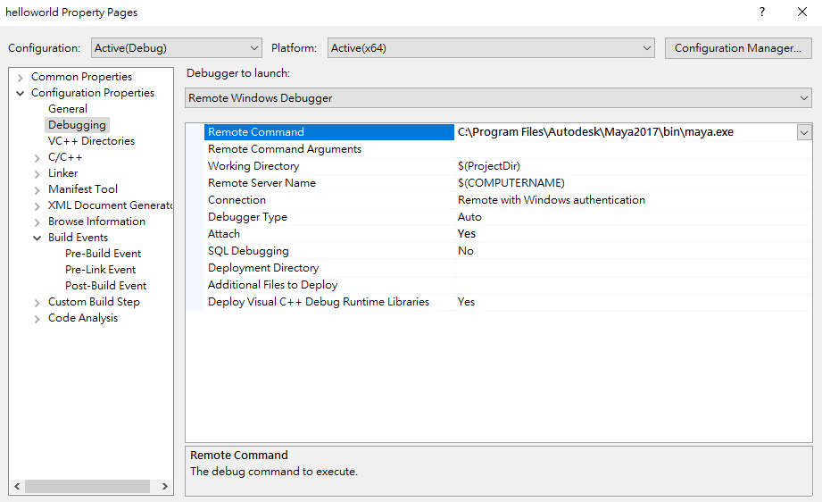
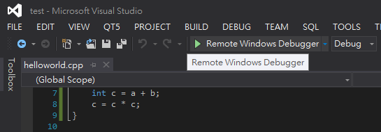
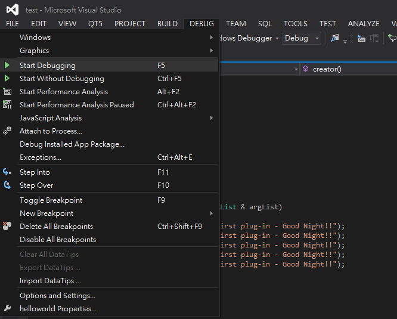
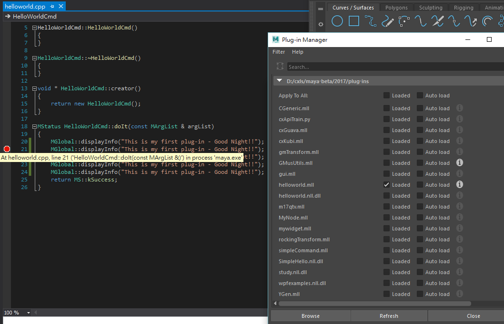
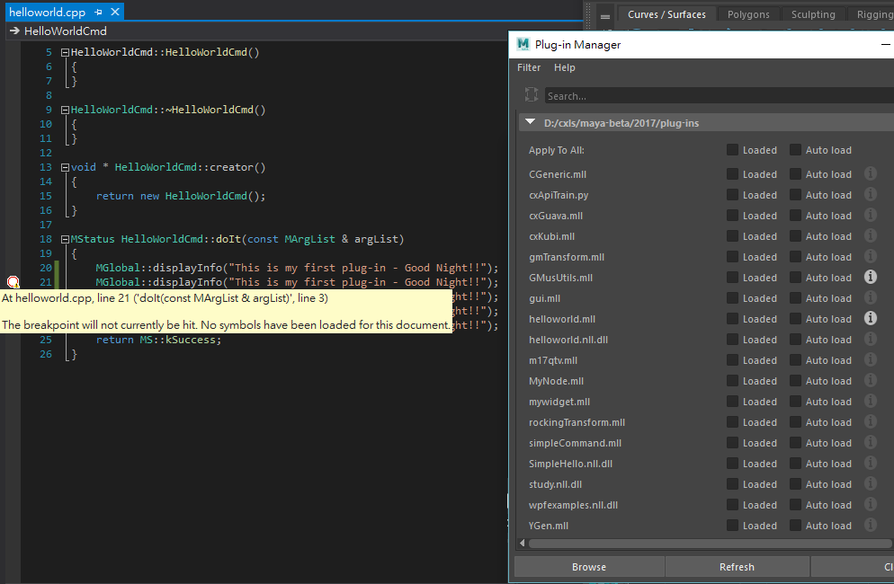
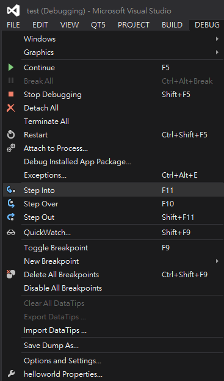

# Visual Studio Debugging in Maya CPP API

## Property Setup

Project -> Properties -> Configuration Properties -> Debugging

Switch `Debugger to launch` to `Remote Windows Debugger` 
Remote Command : __Your Maya application location__ 
For example, _C:\Program Files\Autodesk\Maya2017\bin\maya.exe_

And `Attach` set to __Yes__

## Start Debugging

DEBUG -> Start Debugging 
Swith to `Remote Windwos Debugger` 
Or press \<F5> to start debugging

Before debugging, you must copy *.mll to the folder that Maya can be find. 
But if the plug-in has been loaded by Maya, Can not override it. 
So you have to __unload plug-in__ before copy.

## Debugging Attach

You can join `break point` (F9), if attach Maya successful, it should be red point.

But if no attached, it will be white point.

## Debug Step

Use `Step Into` \<F11> and `Step Over` \<F10> to step debugging 

